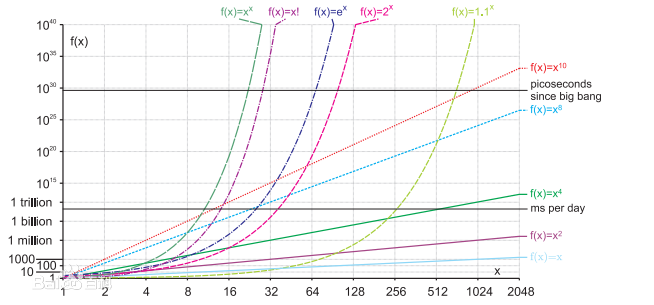

/*
* @Author: Zhang Guohua
* @Date:   2018-09-28 13:57:06
* @Last Modified by:   zgh
* @Last Modified time: 2018-09-28 15:03:59
* @Description: create by zgh
* @GitHub: Savour Humor
*/
# 算法复杂度

1. 指算法程序在运行时需要的资源，包括时间和内存。
2. 算法分析的目的在于选择合适算法和改进算法。一个算法的评价主要从时间复杂度和空间复杂度来考虑。

## 时间复杂度
### 概念
1. 时间频度： 一个算法花费的时间与算法中语句的执行次数成正比例，哪个算法中语句执行次数多，它花费时间就多。一个算法中的语句执行次数称为语句频度或时间频度。记为T(n)。
1. 问题规模： n 指的是算法完成指定问题，所需要的代码量。

2. 时间复杂度: 描述时间频度呈现的规律。 
    1. 若有某个辅助函数f(n),存在一个正常数c使得fn*c>=T(n)恒成立。记作T(n)=O(f(n)),称O(f(n)) 为算法的渐进时间复杂度，简称时间复杂度。
    2. 若有某个辅助函数f(n)，使得当n趋近于无穷大时，T（n)/f(n)的极限值为不等于零的常数，则称f(n)是T(n)的同数量级函数，记作T(n)=O(f(n))，
    3. 随n的增大，时间的增长率和f(n)的增长率成正比。f(n)越小，Tn 越小，算法的时间复杂度越低，算法的效率越高。

4. 算法时间性能分析

    1. 算法耗费的时间和语句频度: 

        1. 一个算法所耗费的时间=**算法中每条语句的执行时间**之和
        
        2. **语句的执行次数**(即频度(Frequency Count))×**语句执行一次所需时间**
    
        3. 算法转换为程序后，每条语句执行一次所需的时间取决于**机器的指令性能**、**速度**以及**编译所产生的代码质量**等难以确定的因素。
        
        4. 去除外在因素。则**一个算法的时间耗费就是该算法中所有语句的频度之和**。
        
    2. 算法耗费的时间和问题规模: （算法求解问题的输入量称为问题的规模(Size),一般用一个整数表示。）
        
        1. 一个算法的时间复杂度(Time Complexity, 也称时间复杂性)T(n)是该算法的时间耗费，是该算法所求解问题规模n的函数。当问题的规模n趋向无穷大时，时间复杂度T(n)的数量级(阶)称为算法的渐进时间复杂度。

        2. T(n)=2n3+3n2+2n 约等于 n3
        
    3. 渐进时间复杂度评价算法时间性能 (主要用算法时间复杂度的数量级(即算法的渐近时间复杂度)评价一个算法的时间性能。)

    4. 算法的时间复杂度不仅仅依赖于问题的规模，还与输入实例的初始状态有关。

5. 最坏时间复杂度: 最坏情况下的时间复杂度称为最坏时间复杂度。最坏情况下的时间复杂度是算法在任何输入实例上运行时间的上界。**不特别说明的情况下，讨论的时间复杂度即为最坏时间复杂度**。

6. 平均时间复杂度: 所有可能的输入实例均以等概率出现的情况下，算法的期望运行时间。

## 空间复杂度
空间复杂度是指算法在计算机内执行时所需存储空间的度量: S(n)=O(f(n))

算法执行期间所需要的存储空间包括3个部分：

1. 算法程序所占的空间；

2. 输入的初始数据所占的存储空间；

2. 算法执行过程中所需要的额外空间。

复杂度分析:

1. 一个算法的空间复杂度只考虑在运行过程中为局部变量分配的存储空间的大小，它包括为参数表中**形参变量分配的存储空间**和为在函数体中定义的**局部变量分配的存储**空间两个部分。

2. 空间复杂度的分析类似于时间复杂度: 即分配的次数与输入的规模n的关系.

3. 当一个算法的空间复杂度与n成线性比例关系时，可表示为O(n).若形参为数组，则只需要为它分配一个存储由实参传送来的一个地址指针的空间，即一个机器字长空间；若形参为引用方式，则也只需要为其分配存储一个地址的空间，用它来存储对应实参变量的地址，以便由系统自动引用实参变量。

## 常见算法及复杂度

1. 常数阶O(1)
2. 对数阶O(log(2)n)
3. 线性阶O(n)
4. 线性对数阶O(nlog(2)n)
5. 平方阶O(n^2),立方阶O(n^3),……
6. K次方阶O(n^k)
7. 指数阶O(2^n)
8. 阶乘O(n!)

图形表示：

